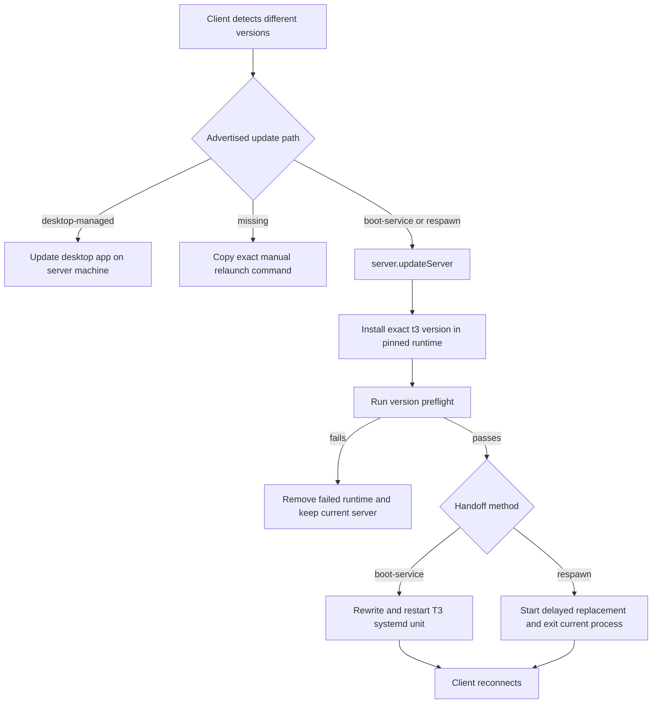

# Server Update Architecture

T3 Code can update a connected server to the exact version of the client that detected version
drift. This path exists primarily for remote environments, where the user may not have a terminal
open on the server machine.

The feature has three boundaries:

- the server advertises whether and how it can be replaced;
- the client chooses the matching user action;
- the server installs and verifies the replacement before handing off the process.

## Detection and Presentation

`ExecutionEnvironmentDescriptor` includes the server version and an optional
`capabilities.serverSelfUpdate` value. The client compares that version with `APP_VERSION` after
loading server config.

The optional capability is intentionally backward compatible. An older server does not know about
the field, so a missing value means the client must offer a manual relaunch instead of sending an
unknown RPC.

The shared `ServerUpdateAction` is rendered in both user-facing version-drift surfaces:

- the conversation banner in `ChatView`;
- primary and saved environment rows in **Settings** → **Connections**.

Both surfaces target the client's exact version. When the reconnected server reports that version,
the mismatch and action disappear.

## Capability Selection

The server resolves its capability once at startup and publishes it in the environment descriptor.

| Advertised value  | Process shape                                                                                 | Client behavior                                                       |
| ----------------- | --------------------------------------------------------------------------------------------- | --------------------------------------------------------------------- |
| `boot-service`    | Linux server running under the T3-managed systemd user service                                | Call the update RPC; the service unit is replaced and restarted.      |
| `respawn`         | Published npm CLI running in the foreground on macOS or Linux                                 | Call the update RPC; the process hands off to a detached replacement. |
| `desktop-managed` | Backend supervised by the desktop app                                                         | Tell the user to update the desktop app on the server machine.        |
| absent            | Older server, development checkout, Windows foreground process, or an unrecognized supervisor | Offer the exact manual relaunch command.                              |

Desktop ownership takes precedence over process-shape detection. A desktop-managed backend must
never spawn a second CLI server beside the app-owned process. Likewise, a process launched by an
unrecognized systemd unit does not claim the foreground respawn path because its supervisor could
bring the old version back.

## Update Flow

`server.updateServer` requires the environment's `orchestration:operate` authorization scope. Its
payload accepts only an exact npm version, including an exact prerelease version; dist-tags such as
`latest` and `nightly` are rejected.

The update service permits one update at a time. It installs `t3@<version>` under
`<baseDir>/runtime/versions/<version>` and writes an install-complete sentinel only after npm exits
successfully. Boot-service setup and self-update share the same process-wide installation lock, so
they cannot mutate a pinned runtime concurrently.

Before any restart, the current Node executable runs the replacement with `--version`. A failed
install, failed preflight, or wrong reported version leaves the current server running. A failed
preflight also removes the candidate runtime so retrying the same version performs a clean install.

## Host Service Lifecycle

The systemd user service is a host lifecycle concern, not a T3 Connect resource. The standalone
`t3 service install`, `uninstall`, `update`, and `status` commands own it. Install and update both
reconcile the unit through `BootService`; running `npx t3@latest service update` therefore pins and
activates the latest CLI release without requiring a connected client.

The `t3 connect` onboarding flow may offer service installation, but it calls the same reconciliation
operation as `t3 service install`. Connect logout only disables cloud access and clears its
authorization; it does not uninstall the host service.

## Process Handoff

For `boot-service`, the server atomically rewrites the T3-managed user unit to point at the verified
runtime, reloads systemd, and restarts the unit. Reload and restart failures restore the previous
unit before returning an error.

For `respawn`, the server starts a detached, delayed replacement that replays the original CLI
arguments. It then acknowledges the request and schedules the current process to exit. The delays
give the acknowledgement time to cross direct or relayed connections before the socket closes.

There is no separate progress stream. The update request remains pending while npm installs and the
client shows a disabled update action. A restart can interrupt the request normally; the connection
runtime keeps the environment registered and reconnects through its usual retry path. After an
acknowledged foreground handoff, the UI keeps the action pending until version sync removes it or a
safety timeout releases it. If a boot-service restart closes the connection before acknowledgement,
the UI releases the interrupted action without reporting a false update failure and lets reconnect
and the next version check determine the result.

## Release Invariant

The exact client version must exist as the `t3` npm package before a client carrying that version is
published. The release workflow therefore makes the GitHub release depend on CLI publication, and
the hosted web deployment depends on that release. See [Release Checklist](../operations/release.md#server-self-update-release-invariant).

## Source Map

- Capability contract: `packages/contracts/src/environment.ts`
- Update RPC contract: `packages/contracts/src/server.ts` and `packages/contracts/src/rpc.ts`
- Capability detection and handoff: `apps/server/src/cloud/selfUpdate.ts`
- Host service commands: `apps/server/src/cli/service.ts`
- Pinned runtime installation: `apps/server/src/cloud/pinnedRuntime.ts`
- Client version comparison: `apps/web/src/versionSkew.ts`
- Shared update action: `apps/web/src/components/ServerUpdateAction.tsx`
